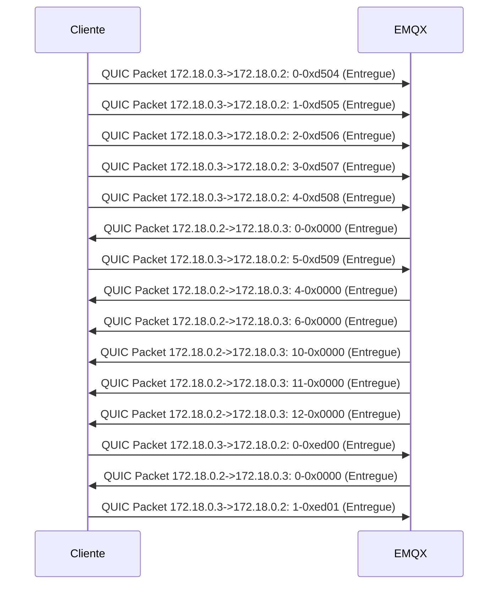
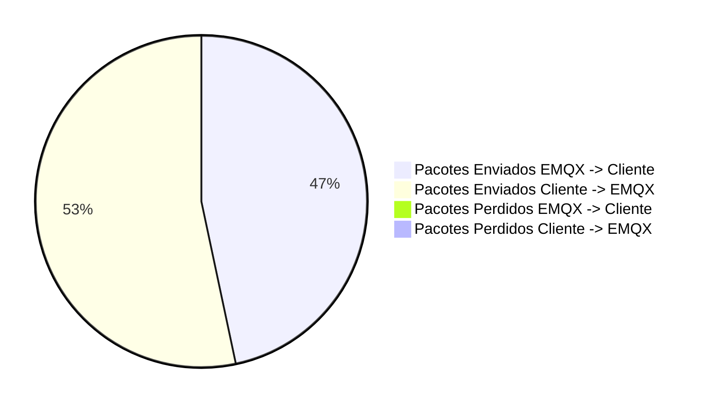

##### Total of packets: 15
##### Total of packets EMQX: 15
##### Total of packets Cliente: 15
##### Total of packets sucess EMQX -> Cliente: 7
##### Total of packets sucess Cliente -> EMQX: 8
##### Total of packets lost EMQX -> Cliente: 0
##### Total of packets lost Cliente -> EMQX: 0
