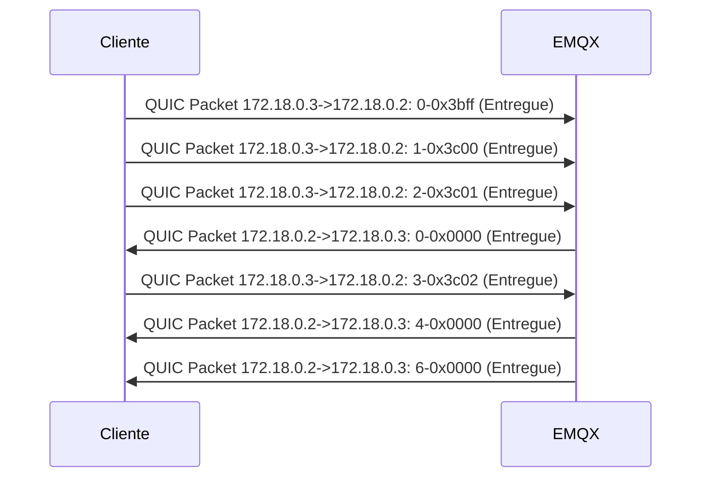
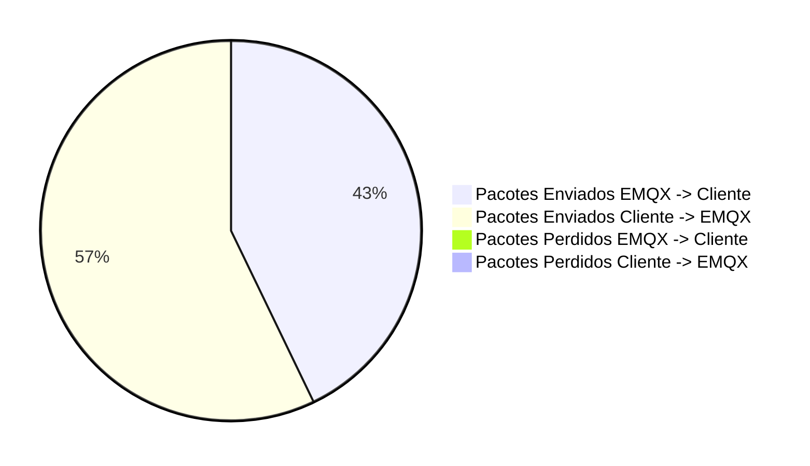

##### Total of packets: 7
##### Total of packets EMQX: 7
##### Total of packets Cliente: 7
##### Total of packets sucess EMQX -> Cliente: 3
##### Total of packets sucess Cliente -> EMQX: 4
##### Total of packets lost EMQX -> Cliente: 0
##### Total of packets lost Cliente -> EMQX: 0
