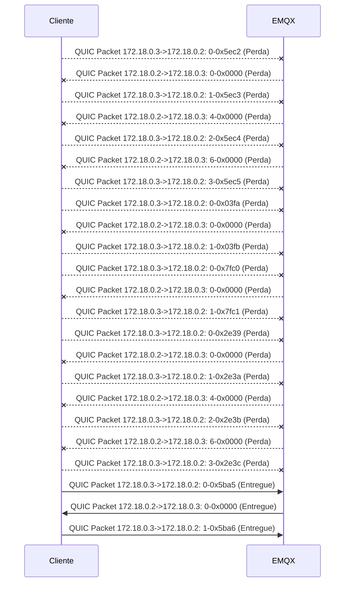
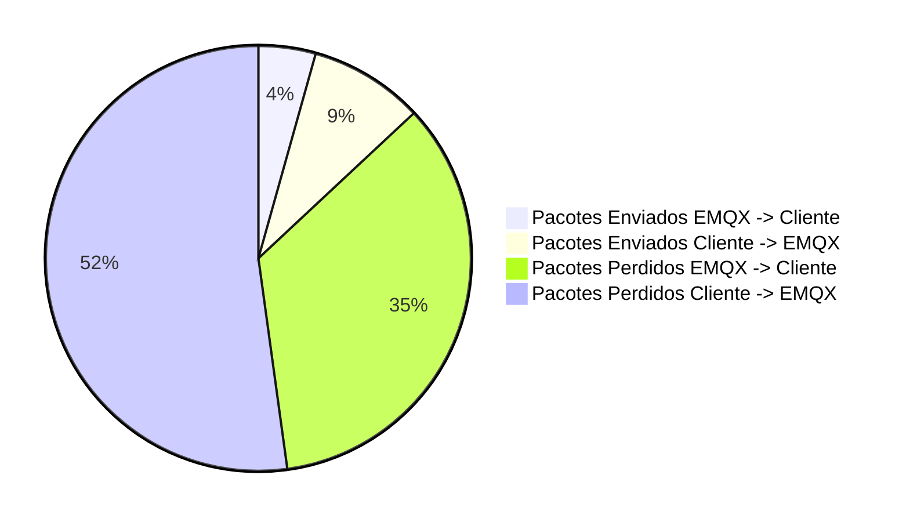

##### Total of packets: 23
##### Total of packets EMQX: 23
##### Total of packets Cliente: 3
##### Total of packets sucess EMQX -> Cliente: 1
##### Total of packets sucess Cliente -> EMQX: 2
##### Total of packets lost EMQX -> Cliente: 8
##### Total of packets lost Cliente -> EMQX: 12
