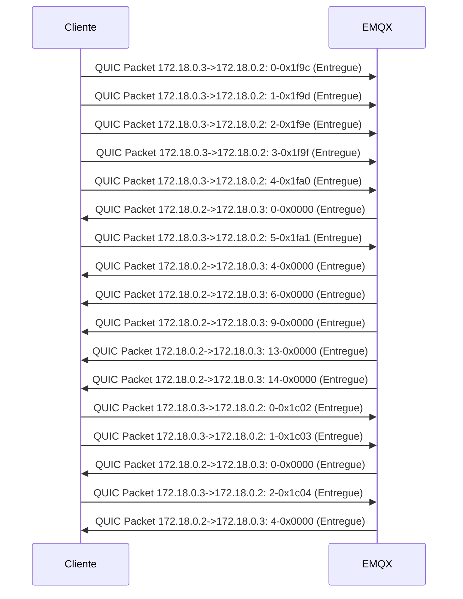
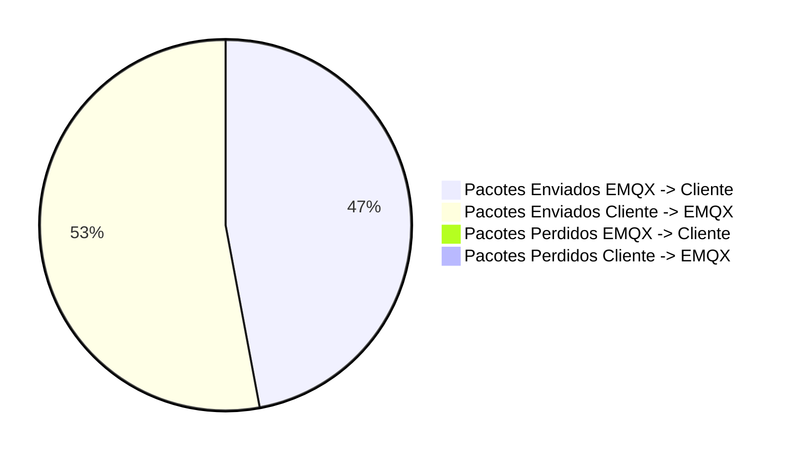

##### Total of packets: 17
##### Total of packets EMQX: 17
##### Total of packets Cliente: 17
##### Total of packets sucess EMQX -> Cliente: 8
##### Total of packets sucess Cliente -> EMQX: 9
##### Total of packets lost EMQX -> Cliente: 0
##### Total of packets lost Cliente -> EMQX: 0
