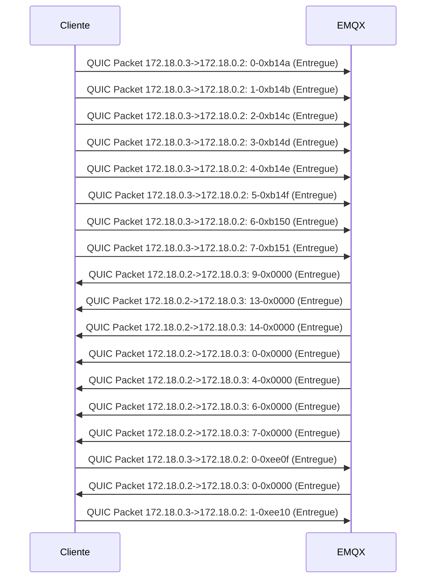
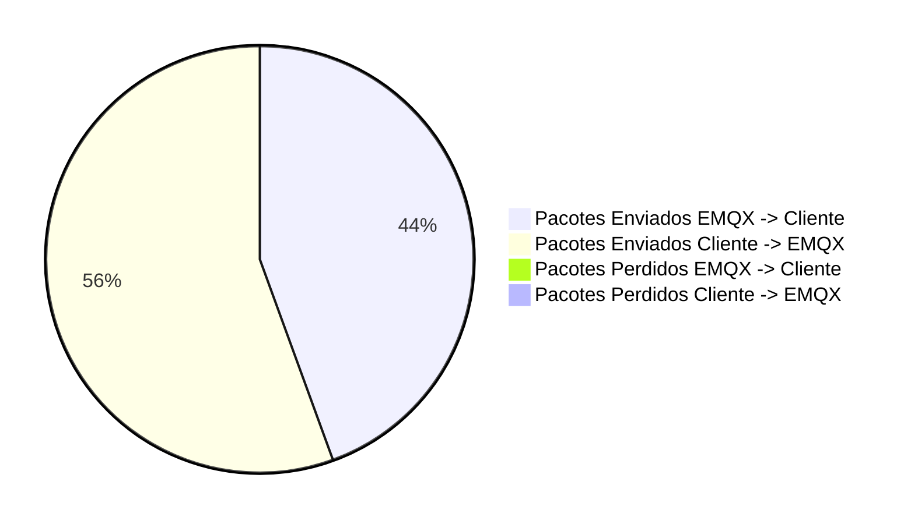

##### Total of packets: 18
##### Total of packets EMQX: 18
##### Total of packets Cliente: 18
##### Total of packets sucess EMQX -> Cliente: 8
##### Total of packets sucess Cliente -> EMQX: 10
##### Total of packets lost EMQX -> Cliente: 0
##### Total of packets lost Cliente -> EMQX: 0
