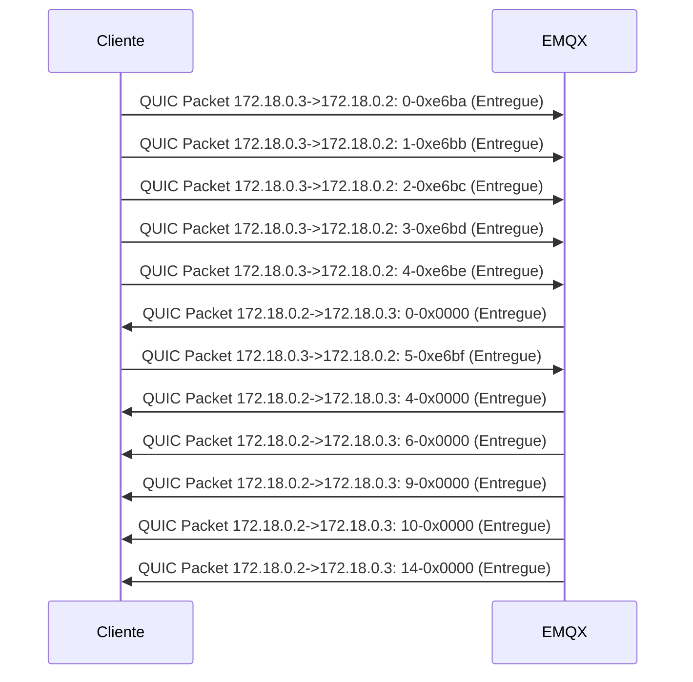
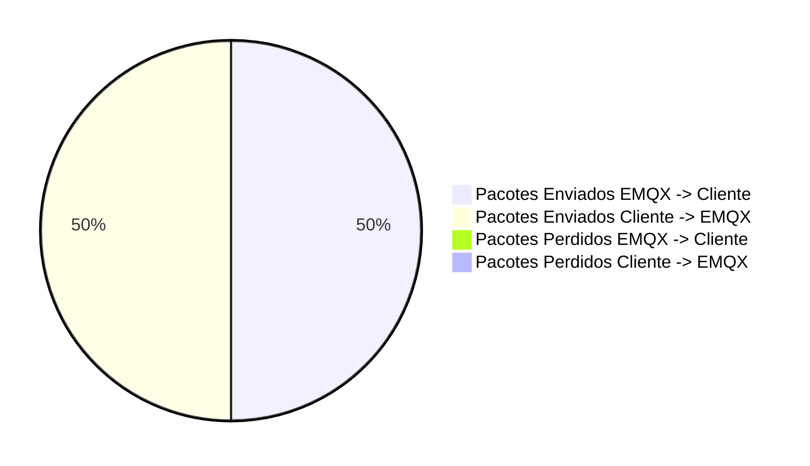

##### Total of packets: 12
##### Total of packets EMQX: 12
##### Total of packets Cliente: 12
##### Total of packets sucess EMQX -> Cliente: 6
##### Total of packets sucess Cliente -> EMQX: 6
##### Total of packets lost EMQX -> Cliente: 0
##### Total of packets lost Cliente -> EMQX: 0
